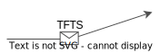

[license-image]: https://img.shields.io/badge/License-MIT-blue.svg
[license-url]: https://opensource.org/licenses/MIT
[pypi-image]: https://badge.fury.io/py/tfts.svg
[pypi-url]: https://pypi.python.org/pypi/tfts
[pepy-image]: https://pepy.tech/badge/tfts
[pepy-url]: https://pepy.tech/project/tfts
[build-image]: https://github.com/LongxingTan/Time-series-prediction/actions/workflows/test.yml/badge.svg?branch=master
[build-url]: https://github.com/LongxingTan/Time-series-prediction/actions/workflows/test.yml?query=branch%3Amaster
[lint-image]: https://github.com/LongxingTan/Time-series-prediction/actions/workflows/lint.yml/badge.svg?branch=master
[lint-url]: https://github.com/LongxingTan/Time-series-prediction/actions/workflows/lint.yml?query=branch%3Amaster
[docs-image]: https://readthedocs.org/projects/time-series-prediction/badge/?version=latest
[docs-url]: https://time-series-prediction.readthedocs.io/en/latest/?version=latest
[coverage-image]: https://codecov.io/gh/longxingtan/Time-series-prediction/branch/master/graph/badge.svg
[coverage-url]: https://codecov.io/github/longxingtan/Time-series-prediction?branch=master
[contributing-image]: https://img.shields.io/badge/contributions-welcome-brightgreen.svg?style=flat
[contributing-url]: https://github.com/longxingtan/Time-series-prediction/blob/master/CONTRIBUTING.md
[codeql-image]: https://github.com/longxingtan/Time-series-prediction/actions/workflows/codeql-analysis.yml/badge.svg
[codeql-url]: https://github.com/longxingtan/Time-series-prediction/actions/workflows/codeql-analysis.yml

<h1 align="center">

</h1><br>

[![LICENSE][license-image]][license-url]
[![PyPI Version][pypi-image]][pypi-url]
[![Download][pepy-image]][pepy-url]
[![Build Status][build-image]][build-url]
[![Lint Status][lint-image]][lint-url]
[![Docs Status][docs-image]][docs-url]
[![Code Coverage][coverage-image]][coverage-url]
[![Contributing][contributing-image]][contributing-url]
[![CodeQL Status][codeql-image]][codeql-url]

**[Documentation](https://time-series-prediction.readthedocs.io)** | **[Tutorials](https://time-series-prediction.readthedocs.io/en/latest/tutorials.html)** | **[Release Notes](https://time-series-prediction.readthedocs.io/en/latest/CHANGELOG.html)** | **[中文](https://github.com/LongxingTan/Time-series-prediction/blob/master/README_CN.md)**

**TFTS** (TensorFlow Time Series) is an easy-to-use python package for time series, supporting the classical and SOTA deep learning methods in TensorFlow or Keras.
- Flexible and powerful design for time series task
- Advanced deep learning models for industry, research and competition
- Documentation lives at [time-series-prediction.readthedocs.io](https://time-series-prediction.readthedocs.io)

## Tutorial

**Installation**

- python >= 3.7
- tensorflow >= 2.3

``` bash
$ pip install tfts
```

**Basic usage**

[](https://colab.research.google.com/drive/1LHdbrXmQGBSQuNTsbbM5-lAk5WENWF-Q?usp=sharing)

``` python
import matplotlib.pyplot as plt
import tfts
from tfts import AutoModel, AutoConfig, KerasTrainer

train_length = 24
predict_length = 8
(x_train, y_train), (x_valid, y_valid) = tfts.get_data("sine", train_length, predict_length, test_size=0.2)

model = AutoModel("seq2seq", predict_length=predict_length)
trainer = KerasTrainer(model)
trainer.train((x_train, y_train), (x_valid, y_valid), n_epochs=3)

pred = trainer.predict(x_valid)
trainer.plot(history=x_valid, true=y_valid, pred=pred)
plt.show()
```

**Prepare your own data**

You could train your own data by preparing 3D data as inputs, for both inputs and targets

- option1 `np.ndarray`
- option2 `tf.data.Dataset`

Encoder only model inputs

```python
train_length = 49
predict_length = 10
n_feature = 2

x_train = np.random.rand(1, train_length, n_feature)
y_train = np.random.rand(1, predict_length, 1)
x_valid = np.random.rand(1, train_length, n_feature)
y_valid = np.random.rand(1, predict_length, 1)

model = AutoModel("rnn", predict_length=predict_length)
trainer = KerasTrainer(model)
trainer.train(train_dataset=(x_train, y_train), valid_dataset=(x_valid, y_valid), n_epochs=1)

```

Encoder-decoder model inputs

```python
# option1: np.ndarray
train_length = 49
predict_length = 10
n_encoder_feature = 2
n_decoder_feature = 3

x_train = (
    np.random.rand(1, train_length, 1),
    np.random.rand(1, train_length, n_encoder_feature),
    np.random.rand(1, predict_length, n_decoder_feature),
)
y_train = np.random.rand(1, predict_length, 1)
x_valid = (
    np.random.rand(1, train_length, 1),
    np.random.rand(1, train_length, n_encoder_feature),
    np.random.rand(1, predict_length, n_decoder_feature),
)
y_valid = np.random.rand(1, predict_length, 1)

model = AutoModel("seq2seq", predict_length=predict_length)
trainer = KerasTrainer(model)
trainer.train((x_train, y_train), (x_valid, y_valid), n_epochs=1)
```

```python
# option2: tf.data.Dataset
class FakeReader(object):
    def __init__(self, predict_length=10):
        train_length = 49
        n_encoder_feature = 2
        n_decoder_feature = 3
        self.x = np.random.rand(15, train_length, 1)
        self.encoder_feature = np.random.rand(15, train_length, n_encoder_feature)
        self.decoder_feature = np.random.rand(15, predict_length, n_decoder_feature)
        self.target = np.random.rand(15, predict_length, 1)

    def __len__(self):
        return len(self.x)

    def __getitem__(self, idx):
        return {
            "x": self.x[idx],
            "encoder_feature": self.encoder_feature[idx],
            "decoder_feature": self.decoder_feature[idx],
        }, self.target[idx]

    def iter(self):
        for i in range(len(self.x)):
            yield self[i]


predict_length = 10
train_reader = FakeReader(predict_length=10)
train_loader = tf.data.Dataset.from_generator(
    train_reader.iter,
    ({"x": tf.float32, "encoder_feature": tf.float32, "decoder_feature": tf.float32}, tf.float32),
)
train_loader = train_loader.batch(batch_size=1)
valid_reader = FakeReader(predict_length=10)
valid_loader = tf.data.Dataset.from_generator(
    valid_reader.iter,
    ({"x": tf.float32, "encoder_feature": tf.float32, "decoder_feature": tf.float32}, tf.float32),
)
valid_loader = valid_loader.batch(batch_size=1)

model = AutoModel("seq2seq", predict_length=predict_length)
trainer = KerasTrainer(model)
trainer.train(train_dataset=train_loader, valid_dataset=valid_loader, n_epochs=1)
```

**Build your own model**

You could build the custom model based on tfts backbone

```python
import tensorflow as tf
from tensorflow.keras.layers import Input, Dense
from tfts import AutoModel


def build_model():
    train_length = 24
    train_features = 15
    predict_length = 16

    inputs = Input([train_length, train_features])
    backbone = AutoModel("seq2seq", predict_length=predict_length)
    outputs = backbone(inputs)
    outputs = Dense(1, activation="sigmoid")(outputs)
    model = tf.keras.Model(inputs=inputs, outputs=outputs)
    model.compile(loss="mse", optimizer="rmsprop")
    return model
```

## Examples

- [TFTS-Bert](https://github.com/LongxingTan/KDDCup2022-Baidu) wins the **3rd place** in KDD Cup 2022 Baidu-wind power forecasting
- [TFTS-Seq2seq](https://github.com/LongxingTan/Data-competitions/tree/master/tianchi-enso-prediction) wins the **4th place** in Alibaba Tianchi-ENSO prediction 2021

<!-- ### Performance

[Time series prediction](./examples/run_prediction.py) performance is evaluated by tfts implementation, not official

| Performance | [web traffic<sup>mape</sup>]() | [grocery sales<sup>wrmse</sup>](https://www.kaggle.com/competitions/favorita-grocery-sales-forecasting/data) | [m5 sales<sup>val</sup>]() | [ventilator<sup>val</sup>]() |
| :-- | :-: | :-: | :-: | :-: |
| [RNN]() | 672 | 47.7% |52.6% | 61.4% |
| [DeepAR]() | 672 | 47.7% |52.6% | 61.4% |
| [Seq2seq]() | 672 | 47.7% |52.6% | 61.4% |
| [TCN]() | 672 | 47.7% |52.6% | 61.4% |
| [WaveNet]() | 672 | 47.7% |52.6% | 61.4% |
| [Bert]() | 672 | 47.7% |52.6% | 61.4% |
| [Transformer]() | 672 | 47.7% |52.6% | 61.4% |
| [Temporal-fusion-transformer]() | 672 | 47.7% |52.6% | 61.4% |
| [Informer]() | 672 | 47.7% |52.6% | 61.4% |
| [AutoFormer]() | 672 | 47.7% |52.6% | 61.4% |
| [N-beats]() | 672 | 47.7% |52.6% | 61.4% |
| [U-Net]() | 672 | 47.7% |52.6% | 61.4% |

### More demos
- [More complex prediction task](./notebooks)
- [Time series classification](./examples/run_classification.py)
- [Anomaly detection](./examples/run_anomaly.py)
- [Uncertainty prediction](examples/run_uncertainty.py)
- [Parameters tuning by optuna](examples/run_optuna_tune.py)
- [Serving by tf-serving](./examples) -->

if you prefer other DL frameworks, try [pytorch-forecasting](https://github.com/jdb78/pytorch-forecasting), [gluonts](https://github.com/awslabs/gluonts), [paddlets](https://github.com/PaddlePaddle/PaddleTS)

## Citation

If you find tfts project useful in your research, please consider cite:

```
@misc{tfts2020,
  author = {Longxing Tan},
  title = {Time series prediction},
  year = {2020},
  publisher = {GitHub},
  journal = {GitHub repository},
  howpublished = {\url{https://github.com/longxingtan/time-series-prediction}},
}
```
